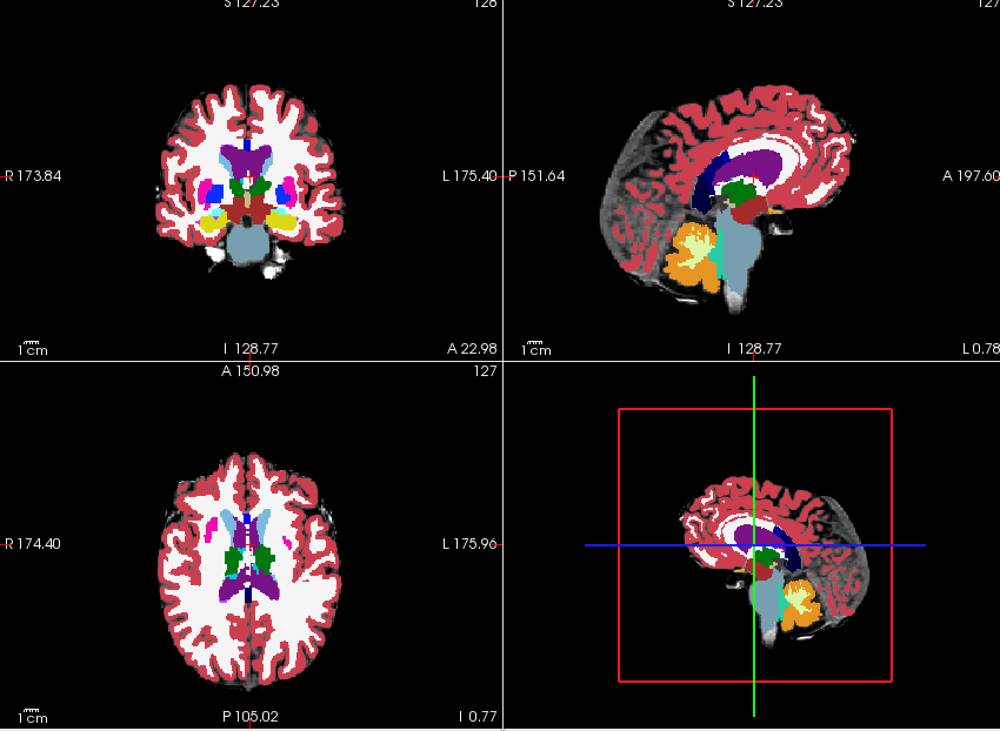
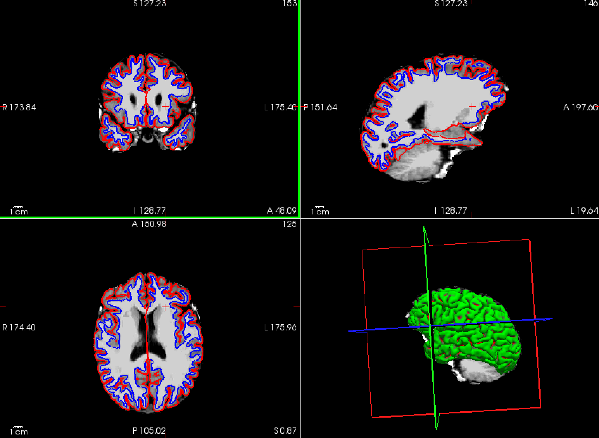
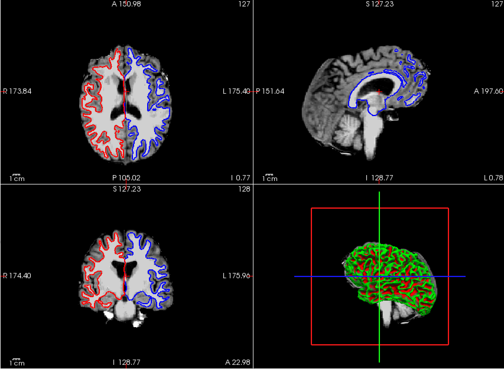

# iEEG Electrode Visualization and FreeSurfer Recon-All Pipeline

This repository contains two primary scripts: one for running the `recon-all` pipeline on T1-weighted MRI images and another for visualizing intracranial EEG (iEEG) electrodes in native space using FreeView.

## Scripts Overview

### 1. `1-recon-all.py`

A script to guide you through the process of running the `recon-all` command on T1-weighted MRI images. The steps include:

- Installing FreeSurfer.
- Setting up the FreeSurfer environment.
- Running the `recon-all` command.
- Visualizing the results using FreeView.

### 2. `2-visualize-electrodes.py`

This script provides instructions for plotting iEEG electrodes in native space using FreeView. Key steps include:

- Preparing the electrode coordinate data.
- Loading the MRI image in FreeView.
- Adding and customizing electrode coordinates.
- Verifying electrode locations to ensure accuracy.

## Figures

### 1. Subcortical Structures Visualization

### 2. White Matter and Pial Surfaces

### 3. Brain Surface Reconstruction

## Important Considerations

